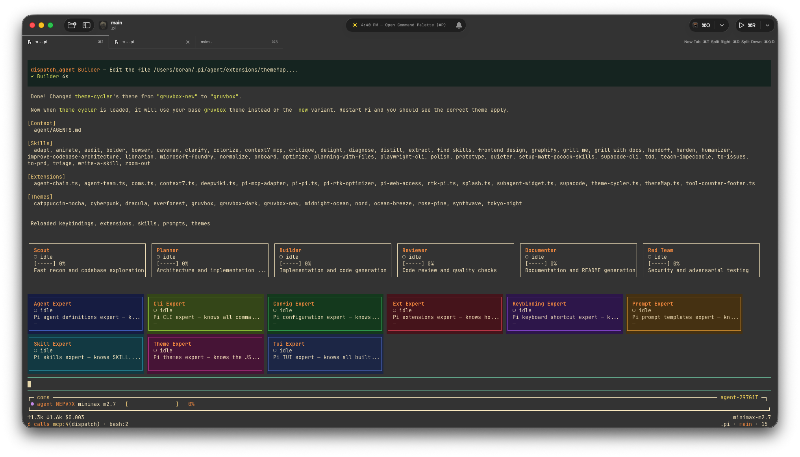

# Pi Config

My personal Pi coding agent setup: built on [pi-subagents](https://pi.dev/packages/pi-subagents) with custom agents, Matt Pocock skills, and MCP integrations.



## What's Included

```
~/.pi/
├── agent/
│   ├── agents/              # Custom agents (scout, researcher, planner, etc.)
│   ├── art/                 # UI art for splash.ts extension
│   ├── extensions/          # UI extensions
│   ├── skills/              # Matt Pocock skills
│   ├── themes/              # UI themes
│   ├── AGENTS.md            # Global orchestration instructions
│   ├── mcp.json             # MCP server configurations
│   └── settings.json        # Configuration
├── README.md                # docs about this project
└── justfile                 # execution instructions via just
```

---

## Custom Agents (pi-subagents)

Built on [pi-subagents](https://pi.dev/packages/pi-subagents), [pi-vs-claude-code](https://github.com/disler/pi-vs-claude-code) with Matt Pocock skills and MCP integrations. Each agent is defined in `~/.pi/agent/agents/` and invoked via `/run`, `/chain`, or `/parallel`.

### Available Agents

| Agent               | Purpose                                                          | Context |
| ------------------- | ---------------------------------------------------------------- | ------- |
| **scout**           | Fast codebase recon - maps entry points, types, data flow, risks | fresh |
| **researcher**      | Web/docs research - searches, fetches, synthesizes evidence      | fresh |
| **planner**         | Turns requirements into implementation plans                     | fork |
| **builder**         | Implementation with /tdd and /diagnose (defaultReads: context.md, plan.md) | fork |
| **reviewer**        | Code review - correctness, tests, simplicity (fresh context)     | fresh |
| **oracle**          | Advisory - challenges assumptions, no edits                      | fork |
| **context-builder** | Strong handoff pass - gathers context + meta-prompt              | fresh |
| **delegate**        | Lightweight generic delegate with parent-like behavior           | fork |
| **documenter**      | Documentation and README generation                              | fork |
| **red-team**        | Security and adversarial testing                                 | fork |
| **plan-reviewer**   | Plan critic — reviews and validates implementation plans         | fork |

### Pi Pi Expert Agents

The `pi-pi` meta-agent uses 10 domain experts for parallel research:

| Expert | Specialty |
|--------|-----------|
| **pi-orchestrator** | Primary meta-agent that coordinates all experts |
| **agent-expert** | Agent .md frontmatter, teams.yaml, agent-team orchestration |
| **cli-expert** | CLI arguments, flags, environment variables |
| **config-expert** | settings.json, providers, models, keybindings |
| **ext-expert** | Building extensions, custom tools, commands |
| **keybinding-expert** | registerShortcut(), modifier combos, terminal compatibility |
| **prompt-expert** | Prompt template .md format, positional arguments |
| **skill-expert** | SKILL.md format, frontmatter fields, validation |
| **theme-expert** | Theme JSON format, all 51 color tokens |
| **tui-expert** | TUI components, custom rendering, overlays |

### Core Orchestration Pattern

```
clarify → scout/research → planner → builder → parallel reviewers → builder fix → validate
```

### Scout

Fast codebase recon that returns compressed context for handoff.

**Tools:** `read`, `grep`, `find`, `ls`, `bash`, `write`, `intercom`, `context7_query_docs`

**Skills (mandatory):** `/zoom-out` for system-level context mapping

**Optional skills:** `/extract` to identify reusable components and design tokens

```typescript
subagent({ agent: "scout", task: "Map the auth flow" });
```

### Researcher

Autonomous web researcher with access to web scraping and documentation tools.

**Tools:**
- `firecrawl_scrape`, `firecrawl_map`, `firecrawl_search`, `firecrawl_crawl` (via pi-web-access)
- `web_search`, `fetch_content`, `get_search_content`, `code_search` (via pi-web-access)
- `context7_resolve_library_id`, `context7_query_docs` (Context7 extension)
- `deepwiki_read_wiki_structure`, `deepwiki_read_wiki_contents`, `deepwiki_ask_question` (DeepWiki extension)
- `playwright_navigate`, `playwright_screenshot`, `playwright_click`, `playwright_fill`, `playwright_evaluate` (Playwright MCP)

```typescript
subagent({
  agent: "researcher",
  task: "Research React Server Components best practices",
});
```

### Planner

Creates implementation plans from context and requirements.

**Tools:** `read`, `grep`, `find`, `ls`, `write`, `context7_*`, `deepwiki_*`, `firecrawl_scrape`, `firecrawl_search`, `firecrawl_crawl`

**Skills (mandatory):**
- `/grill-with-docs` to challenge plan against domain model
- `/to-issues` to break plan into independently-grabbable tickets

```typescript
subagent({
  chain: [
    { agent: "scout", task: "Map the auth flow" },
    { agent: "planner", task: "Plan from {previous}" },
    { agent: "builder", task: "Implement approved plan" },
  ],
});
```

### Builder

Implementation agent with mandatory Matt Pocock skill usage.

**Tools:** `read`, `write`, `edit`, `bash`, `grep`, `find`, `ls`, `contact_supervisor`, `context7_query_docs`, `context7_search_docs`

**Skills (mandatory):**
- `/tdd` for new features (red-green-refactor loop)
- `/diagnose` for bug fixes (reproduce → minimize → hypothesize → fix → test)

**Context:** Auto-reads `context.md`, `plan.md` on spawn

```typescript
subagent({ agent: "builder", task: "Implement the auth middleware" });
```

### Reviewer

Code review with distinct angles from fresh context (no parent history).

**Tools:** `read`, `bash`, `grep`, `find`, `ls`, `write`, `contact_supervisor`, `playwright_navigate`, `playwright_screenshot`, `playwright_click`, `playwright_fill`, `context7_query_docs`, `context7_search_docs`

**Skills:** `/audit` (comprehensive quality), `/polish` (final pass), `/optimize` (performance)

```typescript
subagent({
  tasks: [
    { agent: "reviewer", task: "Correctness + regressions", output: false },
    { agent: "reviewer", task: "Tests + validation", output: false },
    { agent: "reviewer", task: "Simplicity + maintainability", output: false },
  ],
  context: "fresh",
});
```

### Oracle

Second opinion before acting. Challenges assumptions, no edits.

**Tools:** `read`, `grep`, `find`, `ls`, `bash`, `write`, `intercom`, `firecrawl_scrape`, `firecrawl_search`, `context7_query_docs`, `context7_search_docs`

**Skills (mandatory):** `/diagnose` for hard bugs

**Optional skills:** `/grill-with-docs` for architectural decisions, `/distill` for distilling complex information

```typescript
subagent({
  agent: "oracle",
  task: "Advise on the database migration approach",
});
```

### Context Builder

Strong setup pass - gathers code context and writes handoff material.

**Tools:** `read`, `grep`, `find`, `ls`, `bash`, `write`, `firecrawl_*`, `web_search`, `context7_*`, `deepwiki_*`, `intercom`, `contact_supervisor`, `playwright_navigate`, `playwright_screenshot`

**Output:** `context.md` + `meta-prompt.md`

```typescript
subagent({
  agent: "context-builder",
  task: "Gather context for the auth module",
});
```

### Delegate

Lightweight generic delegate with parent-like behavior.

**Tools:** `read`, `grep`, `find`, `ls`, `bash`, `write`, `edit`, `intercom`, `context7_query_docs`, `context7_search_docs`

```typescript
subagent({
  agent: "delegate",
  task: "Quick task or hot path",
});
```

### Documenter

Documentation and README generation.

**Tools:** `read`, `write`, `edit`, `grep`, `find`, `ls`, `contact_supervisor`, `firecrawl_scrape`, `firecrawl_search`, `firecrawl_crawl`

**Skills:** `/onboard` (first-time UX), `/adapt` (cross-platform), `/humanizer` (natural writing), `/bolder` (visual amplification)

```typescript
subagent({
  agent: "documenter",
  task: "Write README for the new API",
});
```

### Red Team

Security and adversarial testing.

**Tools:** `read`, `bash`, `grep`, `find`, `ls`, `contact_supervisor`, `playwright_navigate`, `playwright_screenshot`, `playwright_click`, `playwright_fill`, `firecrawl_scrape`, `firecrawl_search`

**Skills:** `/audit` (comprehensive security review), `/harden` (resilience improvement)

```typescript
subagent({
  agent: "red-team",
  task: "Security review for the auth module",
});
```

### Plan Reviewer

Plan critic - reviews, challenges, and validates implementation plans.

**Tools:** `read`, `grep`, `find`, `ls`, `write`, `contact_supervisor`, `context7_query_docs`, `context7_search_docs`, `deepwiki_search`, `deepwiki_ask`

**Skills:** `/improve-codebase-architecture` (refactoring opportunities), `/distill` (strip to essence)

```typescript
subagent({
  agent: "plan-reviewer",
  task: "Review the auth implementation plan",
});
```

---

## Native Extensions

Custom extensions installed locally in `~/.pi/agent/extensions/`.

### Migrated from [disler/pi-vs-claude-code](https://github.com/disler/pi-vs-claude-code)

| Extension           | Shortcuts           | Purpose                                          |
| ------------------- | ------------------- | ------------------------------------------------ |
| **theme-cycler.ts** | `Ctrl+.` / `Ctrl+,` | Cycle themes with picker or command              |
| **themeMap.ts**     | —                   | Per-extension theme assignments (utility module) |

### Multi-Agent Orchestration Extensions

#### pi-pi.ts

Meta-agent that builds Pi agents using parallel research experts.

**Commands:**

- `/experts` — List available experts and their status
- `/experts-grid <1-6>` — Set grid column count (default: 6)
- `/experts-show` — Show the expert grid widget
- `/experts-hide` — Hide the expert grid widget

**Expert agents:** ext-expert, theme-expert, skill-expert, config-expert, tui-expert, prompt-expert, agent-expert, cli-expert, keybinding-expert

**Usage:** "Build me a theme with dark colors" → pi-pi queries experts in parallel, synthesizes, and writes files.

#### subagent-widget.ts

Background subagent spawning with live TUI widgets.

**Commands:**

- `/sub <task>` — Spawn a background subagent
- `/subcont <id> <prompt>` — Continue an existing subagent's conversation
- `/subrm <id>` — Remove a subagent widget
- `/subclear` — Clear all subagent widgets

**Features:**

- Live streaming progress widget
- Session persistence for multi-turn conversations
- `/subcont` reuses the same session for context continuity

#### agent-team.ts

Dispatcher-only orchestrator with grid dashboard.

**Commands:**

- `/agents-team` — Switch active team
- `/agents-list` — List loaded agents and status
- `/agents-grid <1-6>` — Set grid column count (default: auto-size up to 6)
- `/agents-show` — Show the agent grid widget
- `/agents-hide` — Hide the agent grid widget

**Tool:** `dispatch_agent` — Primary agent delegates work to specialists.

**Teams:** Defined in `~/.pi/agent/agents/teams.yaml` (plan-build, full, info, frontend, pi-pi)

#### agent-chain.ts

Sequential pipeline orchestrator — each step's output feeds into the next.

**Commands:**

- `/chain` — Switch active chain
- `/chain-list` — List all available chains
- `/chain-show` — Show the agent chain footer
- `/chain-hide` — Hide the agent chain footer

**Tool:** `run_chain` — Execute a multi-step workflow.

**Variables:** `$INPUT` (previous step output), `$ORIGINAL` (original prompt)

**Built-in chains:** plan-build-review, plan-build, scout-flow, plan-review-plan, full-review

#### coms.ts

Peer-to-peer messaging between Pi agents on the same machine.

**Commands:**

- `/coms` — Main coms command

**Tools:**

- `coms_list` — List peer agents
- `coms_send` — Send message to peer
- `coms_get` — Get messages from peer
- `coms_await` — Wait for message from peer

**Transport:** Unix sockets (macOS/Linux) / named pipes (Windows)

**Registry:** `~/.pi/coms/projects/<project>/agents/`

**Usage:** Start two pi instances with `--name receiver --project test`, then send messages between them.

---

### justfile

Task runner for common pi launch configurations. Install: `brew install just`

```bash
# List all recipes
just

# Default pi with extensions
just pi

# Agent team with theme cycling
just ext-agent-team

# Agent chain with theme cycling
just ext-agent-chain

# Pi Pi meta-agent
just ext-pi-pi

# Open in new terminal: just open agent-team theme-cycler
```

---

#### theme-cycler.ts

Theme cycling with keyboard shortcuts and command.

**Shortcuts:**

- `Ctrl+.` — Cycle to next theme
- `Ctrl+,` — Cycle to previous theme

**Commands:**

- `/theme` — Open theme picker
- `/theme <name>` — Switch directly (e.g., `/theme synthwave`)

**Features:**

- Status line shows current theme name with 🎨 icon
- Color swatch widget briefly appears after switching
- Default theme: `gruvbox-new`

#### themeMap.ts

Utility module providing theme mapping. Each extension can have a default theme assigned via `THEME_MAP`. When theme-cycler is primary, it defaults to `gruvbox-new`.

#### splash.ts

ASCII art splash screen on session start.

**Features:**

- Two-column layout: logo/tagline (left), stats/shortcuts (right)
- Theme-aware colors with configurable border styles
- Displays: CWD, extensions loaded, skills loaded, tools available
- Quick tips for commands and navigation
- Auto-dismisses on first user message
- Configurable via `~/.pi/agent/art/splash.json`

**No registered commands** — event-driven (session_start, user_message, session_shutdown).

### Context7 Extension

Up-to-date library documentation. Interactive command: `/context7`

**Tools:**

- `context7_resolve_library_id` - Resolve library name to Context7 ID
- `context7_query_docs` - Fetch docs for a library
- `context7_search_docs` - Search library docs

**Usage:**

```typescript
subagent({ agent: "researcher", task: "How to use Prisma transactions?" });
// researcher uses context7_* tools automatically
```

**Used by:** scout, planner, builder, reviewer, oracle, delegate, plan-reviewer

### DeepWiki Extension

GitHub repository documentation and AI Q&A. Interactive command: `/deepwiki`

**Tools:**

- `deepwiki_read_wiki_structure` - List documentation topics
- `deepwiki_read_wiki_contents` - View documentation
- `deepwiki_ask_question` - Ask questions about a repo


**Used by:** planner, plan-reviewer

### Playwright MCP

Browser automation for web testing, screenshots, and scraping.

```json
"playwright": {
  "command": "npx",
  "args": ["@playwright/mcp@latest"]
}
```

**Tools:** `playwright_navigate`, `playwright_screenshot`, `playwright_click`, `playwright_fill`, `playwright_evaluate`

**Used by:** reviewer, researcher, red-team, context-builder

### Firecrawl MCP (Local)

Self-hosted web scraping at `http://localhost:3002` via Docker.

**Setup:**

```bash
git clone https://github.com/mendableai/firecrawl.git ~/Developer/firecrawl
cd ~/Developer/firecrawl && docker compose up -d
```

**Tools:**
| Tool | Description |
|------|-------------|
| `firecrawl_scrape` | Single URL → markdown + metadata |
| `firecrawl_map` | Discover all URLs on a site |
| `firecrawl_search` | Web search |
| `firecrawl_crawl` | Crawl entire website |
| `firecrawl_extract` | Structured data extraction |
| `firecrawl_agent` | Autonomous research agent |

**Used by:** planner, oracle, documenter, red-team

---

## Matt Pocock Skills

High-quality engineering practices for AI coding agents. Installed via:

```bash
npx skills@latest add mattpocock/skills
```

**Skill locations:**

- **Primary source:** `~/.agents/skills/` (40 skills installed via Matt Pocock's installer)
- **Symlinks:** `~/.pi/agent/skills/` (automatically synced from primary)
- **Local skills:** `~/.pi/agent/skills/local/` (custom skills: `bowser`, `graphify`, `supacode-cli`)

Then run `/setup-matt-pocock-skills` to configure per-repo settings.

### Engineering Skills

| Skill                            | When to use                                                             | Best with           |
| -------------------------------- | ----------------------------------------------------------------------- | ------------------- |
| `/diagnose`                      | Hard bugs/performance - reproduce → minimize → hypothesize → fix → test | `oracle`, `builder`  |
| `/grill-with-docs`               | Grilling session + domain model alignment + ADRs                        | `planner`, `oracle` |
| `/tdd`                           | Test-driven development - red-green-refactor loop                       | `builder`          |
| `/triage`                        | Incoming bugs/features - triage through a state machine                 | `researcher`        |
| `/zoom-out`                      | High-level code context in system terms                                 | `scout`             |
| `/extract`                       | Identify reusable components, design tokens, patterns                   | `scout`             |
| `/improve-codebase-architecture` | Refactoring opportunities - consolidation, decoupling, testability      | `plan-reviewer`     |
| `/distill`                       | Strip to essence - distill complex information into essence             | `oracle`, `plan-reviewer` |
| `/audit`                         | Comprehensive quality review - accessibility, performance, security      | `reviewer`, `red-team` |
| `/polish`                        | Final quality pass - alignment, spacing, consistency, detail             | `reviewer`         |
| `/optimize`                      | Performance improvements - loading speed, rendering, animations          | `reviewer`         |
| `/onboard`                       | Design onboarding flows and first-time user experiences                  | `documenter`       |
| `/adapt`                         | Adapt designs across different screen sizes and contexts                | `documenter`       |
| `/humanizer`                     | Remove AI writing patterns and make text natural                        | `documenter`       |
| `/bolder`                        | Amplify safe designs to make them more visually interesting              | `documenter`       |
| `/harden`                        | Improve interface resilience - error handling, i18n, edge cases          | `red-team`         |
| `/prototype`                     | Throwaway prototype for design exploration                              | before committing   |
| `/to-issues`                     | Break plan into independently-grabbable issues                          | `planner`           |
| `/to-prd`                        | Convert feature request into PRD                                        | after `/grill-me`   |

### Productivity Skills

| Skill            | Purpose                                            |
| ---------------- | -------------------------------------------------- |
| `/caveman`       | Ultra-compact communication (~75% token reduction) |
| `/grill-me`      | Get interviewed on a plan/design                   |
| `/handoff`       | Compact conversation for agent handoff             |
| `/write-a-skill` | Create new skills                                  |

### Skill-Workflow Mapping

| Phase         | Skills to invoke                                             |
| ------------- | ------------------------------------------------------------ |
| **Clarify**   | `/grill-me` or `/grill-with-docs` → shared language, ADRs    |
| **Scout**     | `/zoom-out` for system-level context                         |
| **Research**  | `/triage` for issues; `researcher` subagent for evidence     |
| **Plan**      | `/grill-with-docs` check; `/to-issues` to break into tickets |
| **Implement** | `/tdd` for features; `/diagnose` for bugs                    |
| **Review**    | Parallel fresh-context `reviewer` subagents                  |
| **Refactor**  | `/improve-codebase-architecture` periodic audits             |
| **Prototype** | `/prototype` for design exploration                          |

---

## Extensions

### Tool Counter Footer

Displays tool and MCP call counts in the UI footer. Toggle via `/tool-counter`.

**Features:**

- Total tool invocations
- MCP calls breakdown by server
- Built-in tool usage (bash, read, write, edit, grep, find, ls)
- Token usage + model info

---

## Packages

### NPM Packages (via `pi install`)

| Package                | Purpose                                       |
| ---------------------- | --------------------------------------------- |
| `npm:pi-rtk-optimizer` | Auto-rewrites bash to compact rtk equivalents |
| `npm:pi-subagents`     | Async subagent delegation                     |
| `npm:pi-intercom`      | Direct messaging between pi sessions          |
| `npm:pi-web-access`    | Code examples, docs, API references           |
| `npm:pi-mcp-adapter`   | MCP server integration                        |

### pi-intercom

Direct messaging between pi sessions on the same machine. Press **Alt+M** or run `/intercom`.

```typescript
intercom({ action: "send", to: "session-name", message: "..." }); // Fire-and-forget
intercom({ action: "ask", to: "session-name", message: "..." }); // Blocking wait
```

---

## Archon Workflows

[Archon](https://github.com/coleam00/Archon) workflows configured to use **Pi** as provider.

| Workflow                     | Purpose                                           |
| ---------------------------- | ------------------------------------------------- |
| `archon-assist`              | General Q&A, debugging, exploration               |
| `archon-fix-github-issue`    | Issue → implement → validate → PR → review        |
| `archon-idea-to-pr`          | Feature → plan → implement → validate → PR        |
| `archon-plan-to-pr`          | Execute existing plan → implement → validate → PR |
| `archon-refactor-safely`     | Safe refactoring with type-check hooks            |
| `archon-smart-pr-review`     | Targeted PR review                                |
| `maintainer-standup-minimax` | Daily PR/issue triage                             |
| `repo-triage-minimax`        | Repository triage                                 |

**Setup:**

```bash
brew install coleam00/archon/archon
# Create ~/.archon/config.yaml with defaultAssistant: pi
archon serve
```

---

## Security (Recommended)

### [nono](https://nono.sh) - Kernel-level sandbox for pi

nono wraps pi in an OS-level sandbox, restricting filesystem and network access to only what the agent needs. This prevents accidental or malicious access to sensitive paths like `~/.ssh`, `~/.aws`, and shell configs.

**What it protects against:**

- Credential exfiltration via compromised prompts or dependencies
- Unintended writes to system or config files
- Runaway agents modifying files outside the working directory

**Setup:**

```bash
# Install
brew install nono

# Add to ~/.zshrc - run pi sandboxed by default
alias pi='nono run --profile pi --allow-cwd -- pi'

# Reload
source ~/.zshrc
```

**On first run** in a new directory, nono will ask if you want to share that directory with the sandbox. Accept once and it remembers the decision.

**Pre-authorized access:**

- Current working directory (read+write)
- `~/.pi` and subdirectories
- Agent skills and extensions
- `/tmp` (temp files)
- `localhost:3002` (Firecrawl MCP)

**Blocked by default (no config needed):**

- `~/.ssh`, `~/.aws`, `~/.gcloud`, `~/.gnupg`
- `~/.zshrc`, `~/.bashrc`, `~/.profile`
- Browser data, keychain databases

If pi needs access to an additional directory, nono will prompt you during the session with an option to add it to the profile permanently.

---

## Prerequisites

| Dependency             | Purpose                    | Install                                                                             |
| ---------------------- | -------------------------- | ----------------------------------------------------------------------------------- |
| **nono**               | Kernel-level sandbox       | `brew install nono`                                                                 |
| **pi-coding-agent**    | The Pi coding agent        | [earendil-works/pi-coding-agent](https://github.com/earendil-works/pi-coding-agent) |
| **pi-mcp-adapter**     | MCP server integration     | [pi.dev/packages/pi-mcp-adapter](https://pi.dev/packages/pi-mcp-adapter)            |
| **rtk**                | Compact shell commands     | `brew install rubygem-tk`                                                           |
| **Firecrawl**          | Web scraping (optional)    | `docker compose up -d` in firecrawl repo                                            |
| **Matt Pocock Skills** | Engineering best practices | `npx skills@latest add mattpocock/skills`                                           |
| **Archon**             | Workflow engine (optional) | `brew install coleam00/archon/archon`                                               |

### Quick Install

```bash
# 1. Install nono (recommended)
brew install nono

# 2. Create the pi sandbox profile
# The profile defines what pi can access. Get it from your existing setup or create it:
# ~/.config/nono/profiles/pi.json

# 3. Add the sandbox alias to ~/.zshrc
echo "alias pi='nono run --profile pi --allow-cwd -- pi'" >> ~/.zshrc
source ~/.zshrc

# 4. Install pi (follow pi-coding-agent docs)

# 3. Install pi-mcp-adapter
pi install npm:pi-mcp-adapter

# 4. Install rtk
brew install rubygem-tk

# 5. Install RTK optimizer
pi install npm:pi-rtk-optimizer

# 6. Install subagents and intercom
pi install npm:pi-subagents
pi install npm:pi-intercom

# 7. Install Matt Pocock Skills
npx skills@latest add mattpocock/skills

# 8. Install web-access for code lookups
pi install npm:pi-web-access

# 9. (Optional) Start Firecrawl
git clone https://github.com/mendableai/firecrawl.git ~/Developer/firecrawl
cd ~/Developer/firecrawl && docker compose up -d

# 10. (Optional) Install Archon
brew install coleam00/archon/archon
```

---

## Environment Variables

Add API keys to `~/.zshrc`:

```bash
export CONTEXT7_API_KEY="ctx7sk-..."
# Firecrawl runs locally, no API key needed
```

Reload: `source ~/.zshrc`

---

## Quick Reference

| Situation                   | Action                                        |
| --------------------------- | --------------------------------------------- |
| Understand unfamiliar code  | `/run scout "Map X"`                          |
| Need external evidence      | `/run researcher "Research X"`                |
| Hard decision before acting | `/run oracle "Advise on X"`                   |
| Complex work ahead          | `/grill-with-docs` first, then `/run planner` |
| Implement feature           | `/run builder` (after plan approved)           |
| After implementation        | Parallel `/run reviewer` (fresh context)      |
| Bug investigation           | `/diagnose` or `/run oracle`                  |
| New feature idea            | `/grill-me` → `/to-prd`                       |
| Breaking down a plan        | `/to-issues`                                  |
| Periodic codebase health    | `/improve-codebase-architecture`              |
| Design exploration          | `/prototype`                                  |
| Compact mode                | `/caveman`                                    |
| Handoff to another session  | `/intercom` (Alt+M)                           |

---

## Credits

- **[nono](https://nono.sh)** by always-further
- [just](https://github.com/casey/just) by @casey
- **[pi-coding-agent](https://github.com/earendil-works/pi-coding-agent)** by @earendil-works
- **[pi-subagents](https://github.com/nicobailon/pi-subagents)** by nicopreme
- **[pi-web-access](https://github.com/nicobailon/pi-web-access)** by nicopreme
- **[pi-intercom](https://github.com/nicobailon/pi-intercom)** by nicopreme
- **[Matt Pocock Skills](https://github.com/mattpocock/skills)** by @mattpocock
- **[pi-mcp-adapter](https://pi.dev/packages/pi-mcp-adapter)** by nicopreme
- **[pi-rtk-optimizer](https://github.com/MasuRii/pi-rtk-optimizer)** by @MasuRii
- **[Archon](https://github.com/coleam00/Archon)** by @coleam00
- **[Firecrawl](https://github.com/mendableai/firecrawl)** by @mendableai
- **[Context7](https://context7.com)** by Context7
- **[DeepWiki](https://deepwiki.com)** by DeepWiki
- **[Playwright](https://playwright.dev)** by Microsoft
- **[disler/pi-vs-claude-code](https://github.com/disler/pi-vs-claude-code)** — Extension source for theme-cycler, pi-pi, subagent-widget, agent-team, agent-chain, coms
